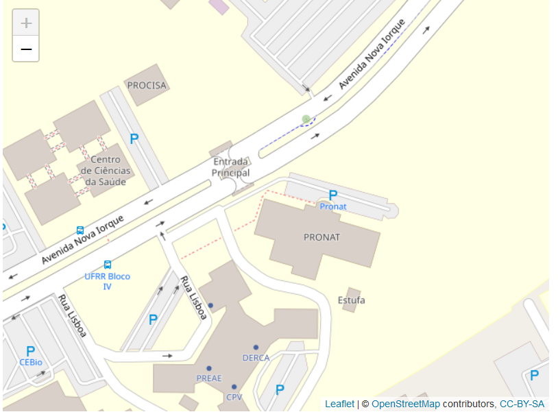
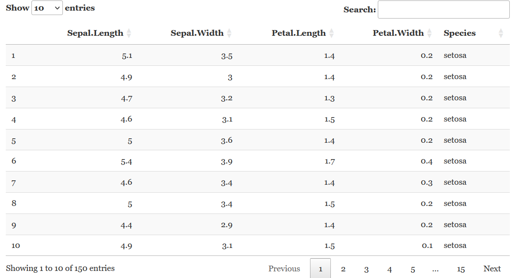

# Introdução

Esta demonstração é abertamente inspirada em uma [apresentação](https://www.youtube.com/watch?v=qLEkUjxk7e8&t=731s) do [Dr. Yihui Xie](https://yihui.org/), desenvolvedor de pacotes muito populares na comunidade do R.
Para esta demonstração, eu traduzi o arquivo original apresentado por ele e modifiquei parte do conteúdo.  

Este é um documento em **R Markdown** [@R-rmarkdown].
Markdown é uma sintaxe simples de formatação para produzir documentos em HTML, PDF, e MS Word etc.
Para mais detalhes sobre o uso deste formato, visite <https://rmarkdown.rstudio.com>.  

# R Markdown

## Incorporar código em R

Você pode incorporar um pedaço de código em R como este:

```{r dados}
dat <- iris[, 1:2]
names(dat) <- c('x', 'y')
str(dat)
```

## Gráficos

```{r mtcars}
library("ggplot2")
ggplot(mtcars, aes(wt, mpg)) +
  geom_point(size = 3, aes(colour = factor(cyl))) + 
  theme(legend.position = "none")
```

## Criar tabelas simples

```{r}
fit <- lm(y ~ x, data = dat)
tab <- coef(summary(fit))  # coeficientes de regressao
knitr::kable(tab, 'simple', caption = 'Uma tabela simples. Não preciso me preocupar com a numeração das tabelas.')
```

## Código embutido para um modelo matemático

O modelo ajustado é: $$Y = `r tab[1, 1]` + `r tab[2, 1]`X$$ 

# Outras características

## Legenda da figura

Você pode também adicionar legendas e números às figuras.
Veja a figura \@ref(fig:diamonds), por exemplo.  

```{r diamonds, fig.cap='Um box plot simples. Incluir legendas é fácil.', tidy=FALSE, exercise=TRUE}
ggplot(diamonds, aes(cut, price)) +
  geom_boxplot()
```

## Conteúdo dinâmico - mapa interativo

Veja no mapa abaixo a localização do PRONAT-UFRR:

```{r, eval=FALSE}
library("leaflet")
leaflet() |>
  addTiles() |>
  setView(-60.691585, 2.834153, zoom = 19)
```

```{r, leaflet, echo=FALSE, out.width="70%"}
if (
  any(c("pdf_document", "tint::tintPdf", "bookdown::pdf_book", "word_document", "powerpoint_presentation", "beamer_presentation") %in% rmarkdown::all_output_formats(knitr::current_input()))
    ) {
  
} else{
  leaflet::leaflet() |>
  leaflet::addTiles() |>
  leaflet::setView(-60.691585, 2.834153, zoom = 19)
}
```

## Conteúdo dinâmico - `DataTables`

```{r, eval=FALSE}
library("DT")
DT::datatable(iris)
```

```{r, dt, echo=FALSE, out.width="70%"}
if (
  any(c("pdf_document", "tint::tintPdf", "bookdown::pdf_book", "word_document", "powerpoint_presentation", "beamer_presentation") %in% rmarkdown::all_output_formats(knitr::current_input()))
    ) {
  
} else {
  DT::datatable(iris)
} 
```

# Referências

```{r, include=FALSE}
knitr::write_bib(loadedNamespaces(), file = 'R-packages.bib')
```
