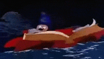
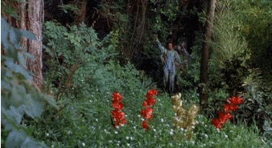
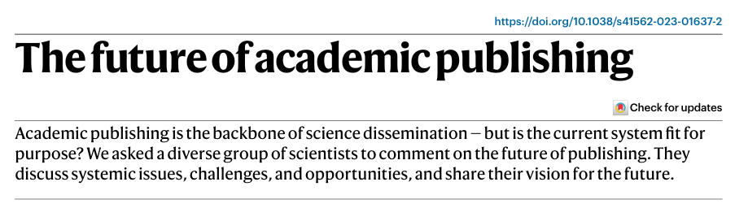
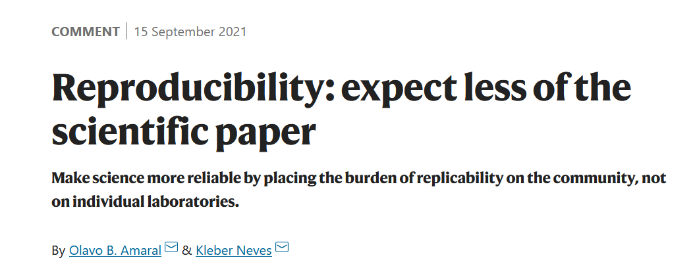
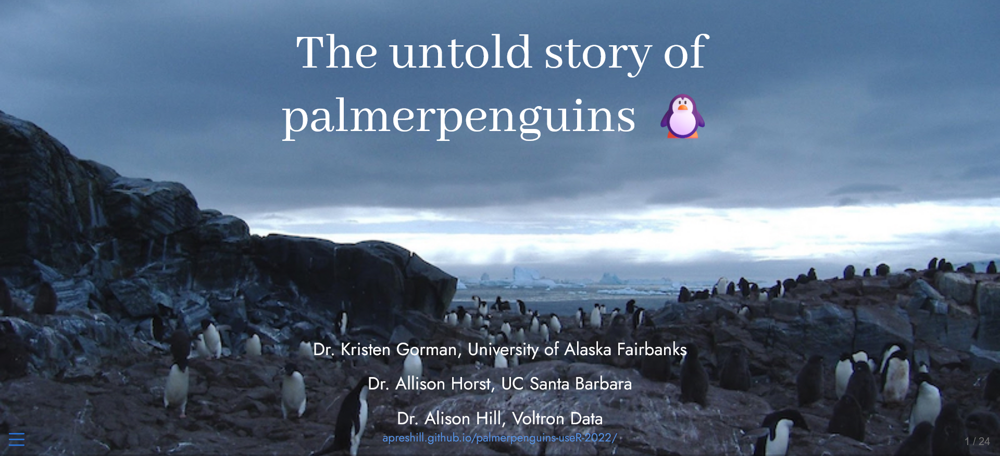
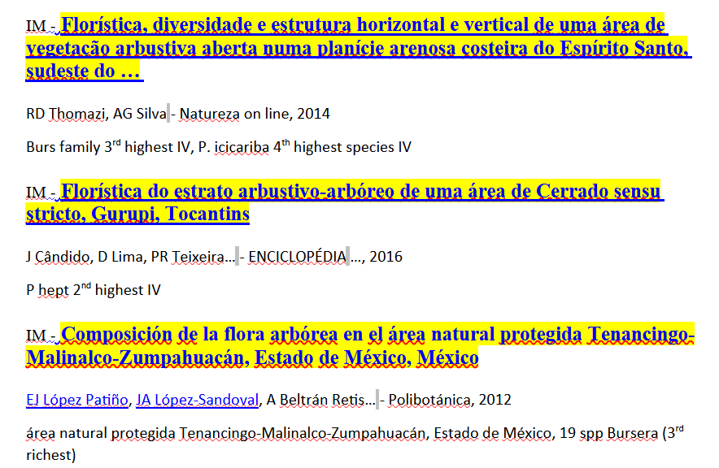
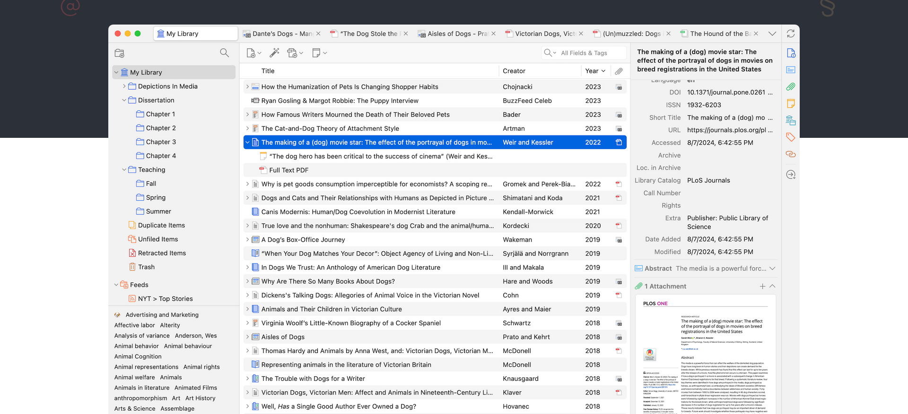
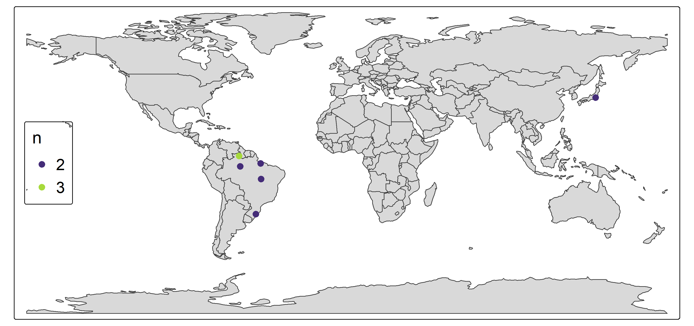

```{r}
#| label: setup
#| include: false
options(htmltools.dir.version = FALSE)
knitr::opts_chunk$set(echo = FALSE,
                      collapse = TRUE,
                      warning = FALSE,
                      message = FALSE,
                      fig.retina = 3,
                      out.width = "100%")
suppressPackageStartupMessages(library("xaringanthemer"))
suppressPackageStartupMessages(library("metathis"))
suppressPackageStartupMessages(library("knitcitations"))
library("knitr")

library("googlesheets4")

library("dplyr")
library("tibble")

suppressPackageStartupMessages(library("emoji"))

library("tmap")
library("maps")
library("sf")

data("World")

library("janitor")
library("ggplot2")
theme_set(theme_classic())
```

```{r}
#| label: xaringan-themer
#| include: false
style_duo_accent(primary_color = "#035AA6", secondary_color = "#03A696")
```

```{r}
#| label: xaringanExtra
#| include: false
xaringanExtra::use_xaringan_extra(c("tile_view", "tachyons"))
```

```{r}
#| label: xaringanExtra-share-again
#| include: false
xaringanExtra::use_share_again()
```

```{r}
#| label: emoji
#| include: false
#| eval: true
desespero <- 
  emojis |> filter(name == "person facepalming") |> 
  pull(emoji)
fantasma <- 
  emojis |> 
  # filter(grepl("ghost", name))
  filter(name == "ghost") |>
  pull(emoji)
```

```{r}
#| include: false
#| eval: true
# prepara_dados_demo.R
load("output/dados_demo.RData")
```

class: left, middle
background-image: url("images/slide_abertura.png")
background-size: cover


.pull-left[

# `r rmarkdown::metadata$title`

### `r rmarkdown::metadata$author`

### `r rmarkdown::metadata$org` / `r rmarkdown::metadata$date`

]

???

Imagem da parte direita do slide de abertura obtida de <https://rmarkdown.rstudio.com/>

---

name: sou-eu

class:inverse

background-image: url("images/who-am-i.001.jpeg")
background-repeat: no-repeat
background-position: 10% 40%
background-size: contain

.pull-left[

<br><br>
<br>
<br>

### `r rmarkdown::metadata$author`
  
### `r rmarkdown::metadata$org`
    
### [`r icons::fontawesome("paper-plane")` ricoperdiz@gmail.com](mailto:ricoperdiz@gmail.com)
    
### [`r icons::fontawesome("link")` ricardoperdiz.com](https://ricardoperdiz.com)
    
### [`r icons::fontawesome("github")` @ricoperdiz](https://github.com/ricoperdiz)
    
]

---

name: metodo-usual

.pull-left[

<br>
<br>
<br>

.center[



]
]

.pull-right[
<br>
<br>


]

.footnote[Fonte: [giphy.com](https://giphy.com/)]

---

name: publica-resultados
class: inverse

## Resultados publicados! 

.center[
```{r}
#| out-width: "45%"
memer::meme_get("NoneOfMyBusiness") |> 
  memer::meme_text_top("É...") |> 
  memer::meme_text_bottom("venci! bora pra outra!")
```
]

---

class: inverse, center, middle

# Sistema em crise

---

## Indústria do bloqueio

```{r}
knitr::include_url("https://www.jstor.org/stable/23254319")
```

???

Próprios autores de artigos não possuem acesso ao mesmo.

---

name: crise-reproduti

<br>
<br>
<br>
<br>
<br>
<br>


.foonote2[[Ahmed et al. 2023](https://doi.org/10.1038/s41562-023-01637-2)]

???

Pontos do trabalho:
+ We must dismantle access barriers
+ Preprints can improve publishing
+ Eliminate peer review
+ Address global inequalities
+ We need more geographic diversity
+ Fight fraudulent publishing
+ Editors and reviewers need to do better.  

---

<br>
<br>
<br>
<br>



.footnote2[[Amaral e Neves 2021](https://www.nature.com/articles/d41586-021-02486-7)]

---

background-image: url(images/workflow.png)
background-size: contain
background-position: bottom
class: center, top
background-color: #fff

.left[.footnote[[Why use R markdown?](https://intro2r.com/why-use-r-markdown.html#why-use-r-markdown)]]

---

name: o-que-e-rmarkdown

class: center, middle, inverse

## _R Markdown_ fornece uma **estrutura** de autoria unificada para ciência de dados, **combinando** seu _código_, seus _resultados_ e seus _comentários_ em **prosa**<sup>1</sup>

.footnote[(1) https://r4ds.had.co.nz/r-markdown.html]

---

class: middle, center

# Comunicação

--

# Colaboração

--

# Ambiente para se fazer ciência

---

class: middle, center, inverse

# E daí?

--

# .LARGE[POR QUÊ?]

???

https://intro2r.com/why-use-r-markdown.html

---

class: inverse, center, middle

## Transparência

--

## Disponibilidade dos dados

--

## Reutilização de dados

---
class: inverse, center, middle

# .LARGE[Reprodutibilidade]

---

class: inverse, center, middle

# Funcionalidades

---

class: middle

# Livro

```{r}
knitr::include_url("https://intror.netlify.app/")
# knitr::include_graphics("images/intror.png")
```

.footnote[https://intror.netlify.app/]

---

class: middle

# Apresentações

```{r}
knitr::include_url("https://minicurso-elaboracao-mapa-r-dia01.netlify.app/")
# knitr::include_graphics("images/pres.png")
```

.footnote[https://minicurso-elaboracao-mapa-r-dia01.netlify.app/]

---

class: middle

# Artigos científicos

```{r}
knitr::include_url("https://pkgs.rstudio.com/rticles/articles/examples.html")
# knitr::include_graphics("images/rticles.png")
```

.footnote[https://pkgs.rstudio.com/rticles/articles/examples.html]

---

class: middle

# Páginas na rede

```{r}
knitr::include_url("https://peldforr.org/")
# knitr::include_graphics("images/eu.png")
```

.footnote[https://peldforr.org/]

---

class: middle

### Apresentação de pacote R

```{r}

```

.footnote2[[The untold story of palmerpenguins](https://apreshill.github.io/palmerpenguins-useR-2022/#/title-slide)]

---

class: middle

# *Dashboard*

```{r}
include_url("https://wch.github.io/retirement-simulation-dashboard/")
```

---

class: inverse, center, middle

# Comunicar == organização

---

<br>
<br>
<br>
.pull-left[
.center[

```{r}

```

]
]

.pull-right[
.center[
```{r}

```

]
]

---
class: middle

# Formatar referências == Pesadelo `r fantasma``r desespero``r desespero``r desespero``r fantasma`

---

# Zotero


.footnote2[[Zotero](https://www.zotero.org/)]

---

class: middle, inverse, center


```{r}
#| out-width: "50%"
memer::meme_get("AgnesWink") |> 
  memer::meme_text_top("RMarkdown ...") |> 
  memer::meme_text_bottom("é a solução!")
```

---

## Buscar a referência

```{r, attr.output='style="max-height: 100px;"'}
citation("MASS")
```


---

<!-- class: middle -->

## Compilar um arquivo `.bib`

```{r}
citation("MASS") |> toBibtex()
```

---

class: middle, center, inverse


```{r, include = FALSE}
citet(citation("MASS"))
```

## Escrever em Rmarkdown

```
----
author: "R. Perdiz"
bibliography: bib.bib
----

## Material e métodos

Utilizamos a função `lda()` do pacote MASS [@MASS] para efetuar uma análise discriminante.

## Referências


```

---

class: middle, center

## Material e métodos


Utilizamos a função `lda()` do pacote MASS (Venables & Ripley, 2002) para efetuar uma análise discriminante.

## Referências

```{r, comment="", results='asis'}
bibliography(style = "text")
```

---

background-image: url(https://r3-rmedicine.netlify.app/slides/images/quarto-how.png)
background-size: contain
background-position: bottom
class: center, top
background-color: #fff

# Como funciona ???

.left[
.footnote[Imagem: [https://r3-rmedicine.netlify.app/slides/images/quarto-how.png](https://r3-rmedicine.netlify.app/slides/images/quarto-how.png)]
]

---

class: center, middle

# Demonstração 1

## Acessem esse formulário <https://forms.gle/PyLww3FCCqoqSxVG9>

---

## Onde eu gostaria de estar agora?

```{r}
#| include: false
mapa <- tm_shape(World) +
  tm_borders() +
  tm_shape(filter(cidades_coord, !is.na(n))) +
  tm_dots(
    fill = "n", 
    fill.scale = tm_scale(values = "viridis"),
    size = .6
  ) +
  tm_layout(legend.position = c("left", "center"), legend.title.size = 1.5, legend.text.size = 1.4)
tmap_save(mapa, filename = "images/tmap.png")
```
.center[
  
]

---

## Relação entre número de calçado e altura de discentes presentes aqui, agora

.center[
```{r}
#| eval: true
#| message: false
#| out-width: "45%"
#| out-height: "60%"
dad |> 
  ggplot(aes(calcado, altura)) +
  geom_point() +
  geom_smooth(method = "lm") +
  labs(
    x = "Número do calçado",
    y = "Altura (m)",
    title = "Dados coletados em sala de aula",
    subtitle = "Discentes da disciplina PR09 Comunicação Científica"
  )
```
]
---

class: inverse, center, middle

# Demonstração 2

---

class: middle

# Onde podemos aprender mais?

--

### [https://rmarkdown.rstudio.com/](https://rmarkdown.rstudio.com/)

--

### [https://quarto.org/](https://quarto.org/)

--

### [Livro da disciplina de RMarkdown PRONAT UFRR](https://intrormarkdown.netlify.app)

--

### Ou então ...

---

class: inverse, middle

.pull-left[
## Disciplina 

## **Tópicos especiais - Rmarkdown**

# comigo!
]

.pull-right[


]

.footnote[Fonte: [giphy.com](https://giphy.com/)]

---

name: gracias
class: middle

background-image: url("images/logos_abertura.png")
background-repeat: no-repeat
background-position: 80% 05%
background-size: 30%

.pull-left[


.footnote[Fonte: [giphy.com](https://giphy.com/)]

]

.pull-right[

# Grato pela atenção!

## Perguntas ?

### [`r icons::fontawesome("paper-plane")` ricoperdiz@gmail.com](mailto:ricoperdiz@gmail.com)
    
### [`r icons::fontawesome("link")` ricardoperdiz.com](https://ricardoperdiz.com)
    
### [`r icons::fontawesome("github")` @ricoperdiz](https://github.com/ricoperdiz)

]


